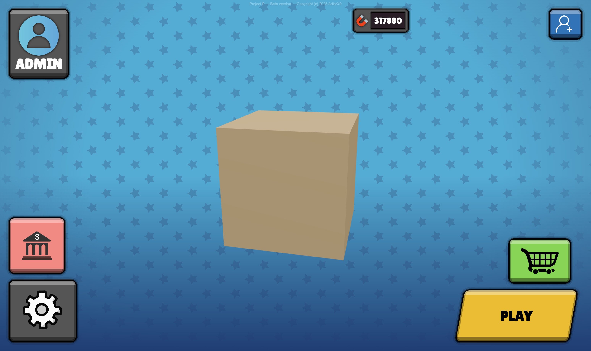
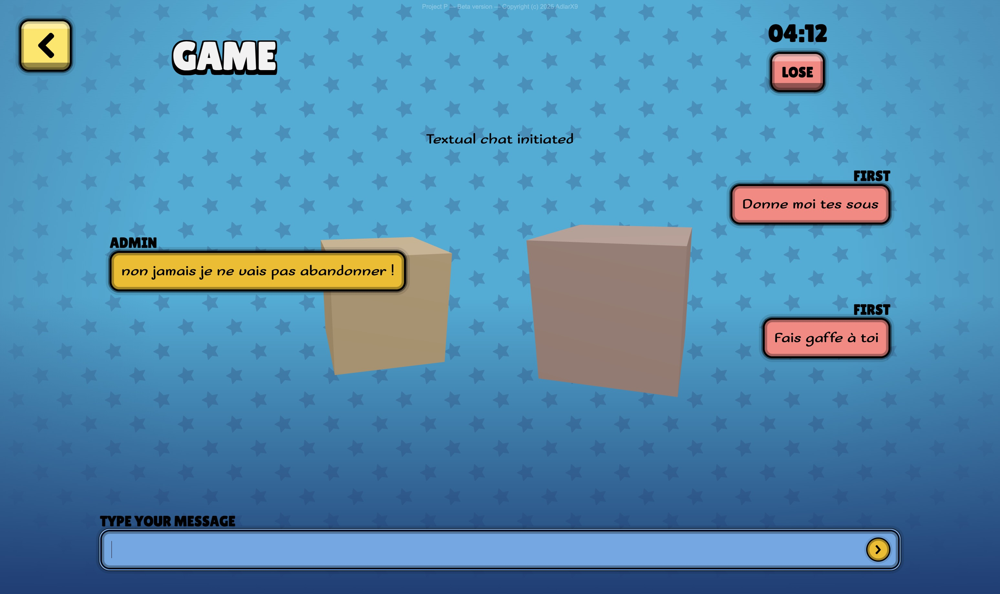
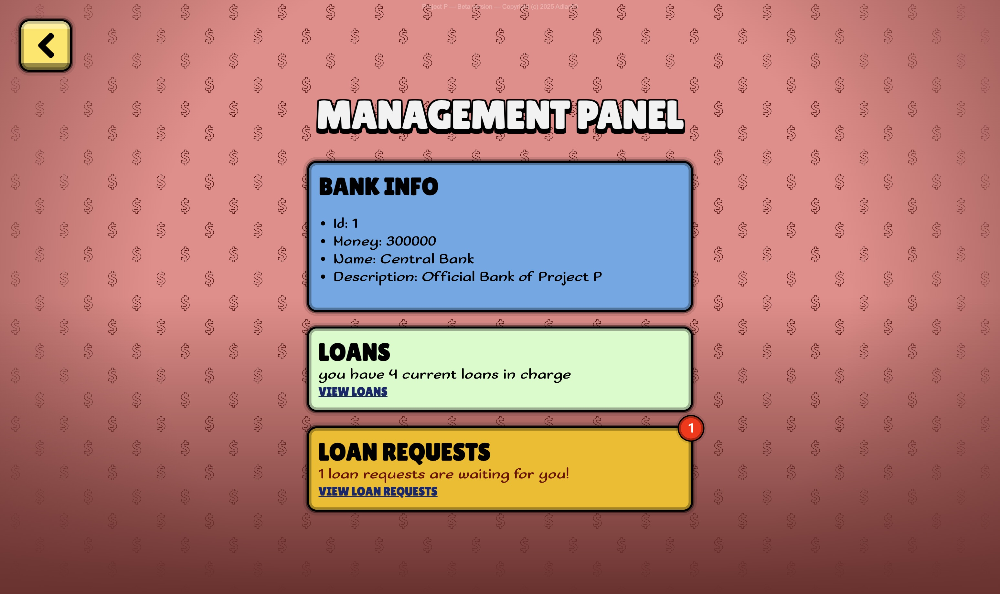
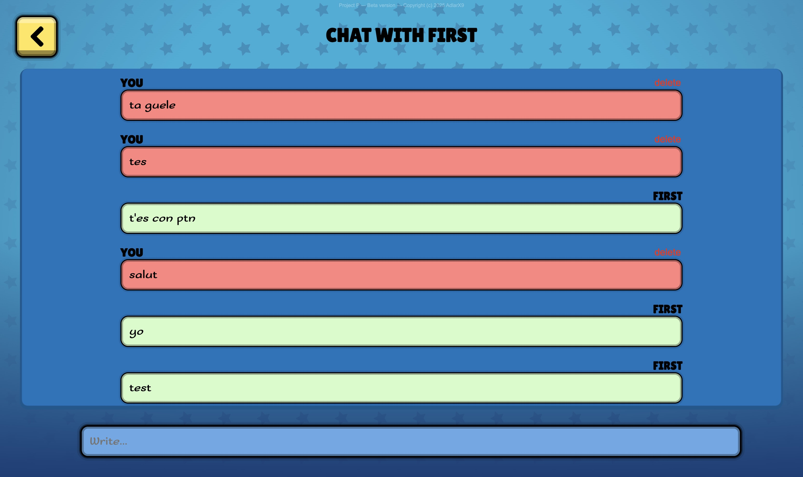
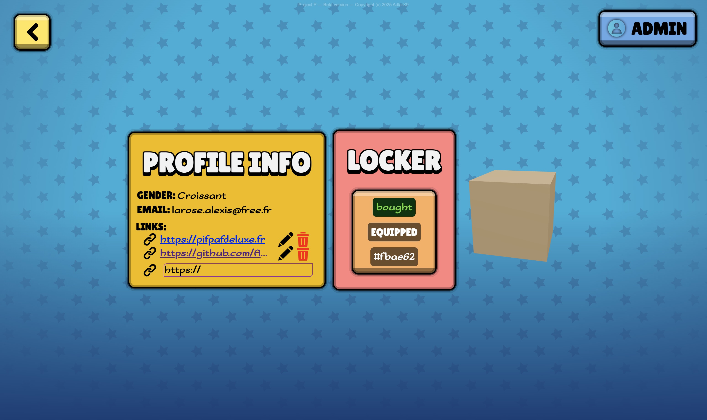
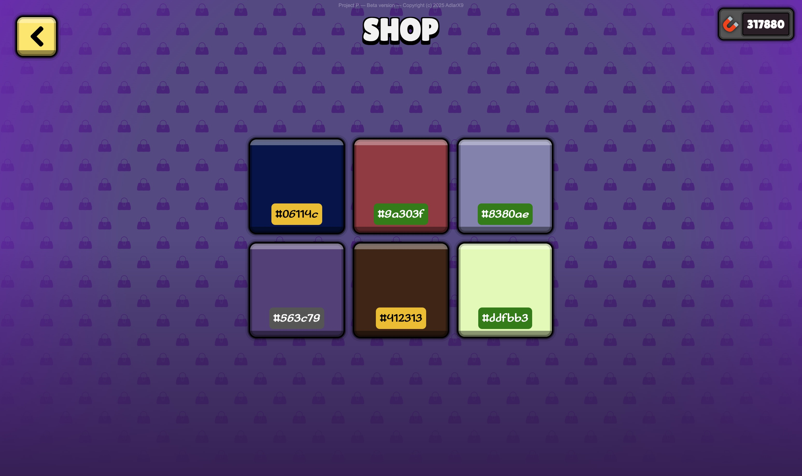
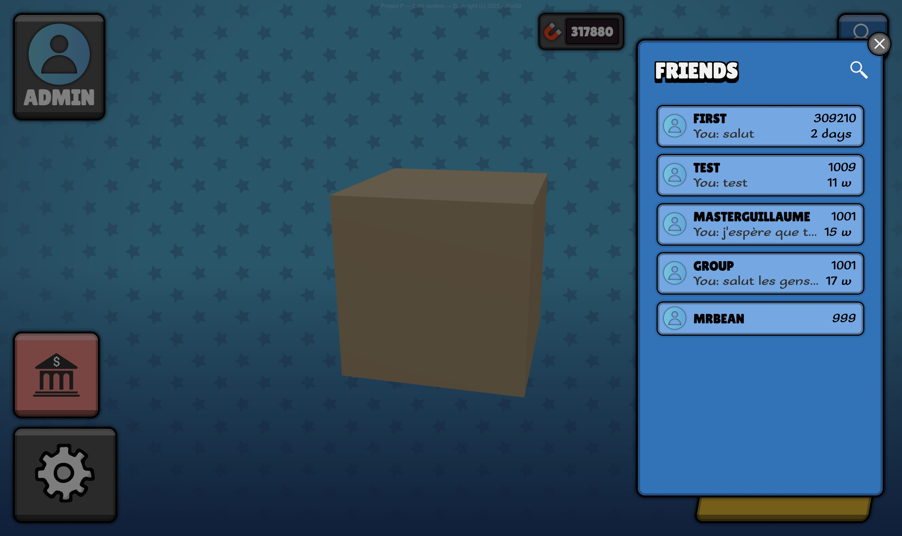
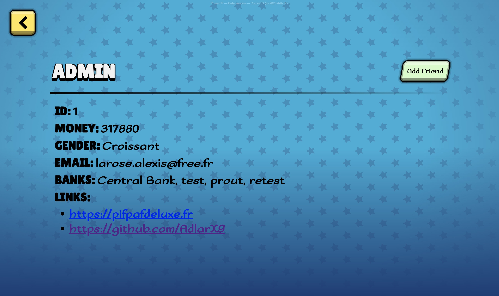
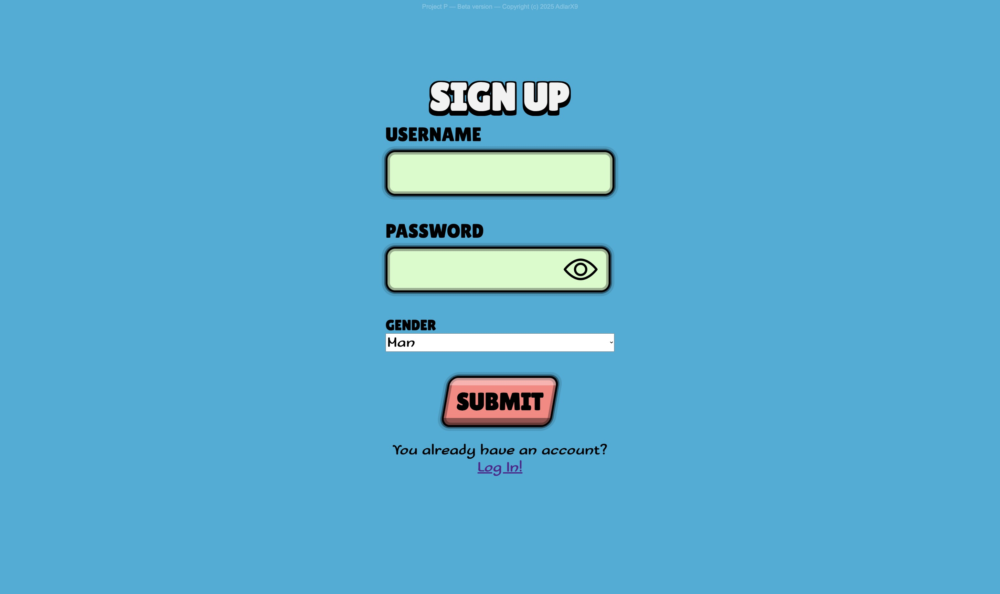
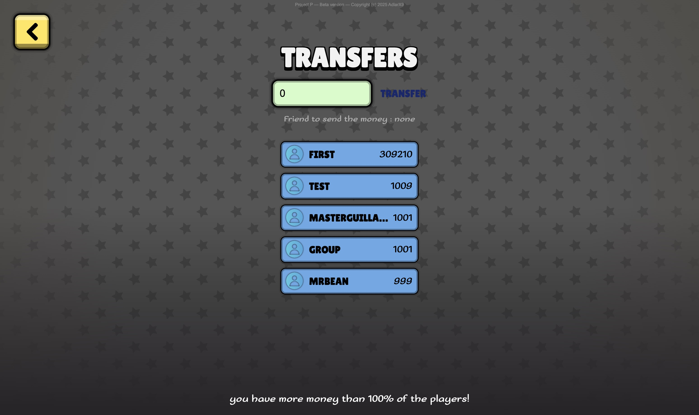

# Project P


## Overview

**Project P** is an interactive platform where your main objective is to **accumulate as much virtual money as possible** by using all the available features.

Built as a fully containerized **web application** using *Docker*, it leverages *React* along with popular libraries such as *React Cookie*, *React Three*, *TanStack Query*, and *React Router DOM*. The stack also includes *Webpack*, *Framer Motion*, *Nginx*, *Symfony*, *Mercure*, *Redis*, and *PostgreSQL*.

With *Project P*, you can **create an account**, **add friends**, **chat** with them, **transfer virtual currency**, **create your own bank**, **request and manage loans**, **play competitive games** against other users, and **buy items** from the shop to **customize your avatar** — which is, by the way, a cube!

— **What does a game look like?**
— Each match lasts a **maximum of 5 minutes**. At the end of this time, one player must choose to **lose the game** by giving 50 to their opponent. The main objective during the game is to **convince your opponent** that you won’t give up — either through messages or directly via **voice chat**.
— **And what if no one gives up?**
— Then both players lose 200, which is transferred to the **Central Bank**, managed by the Admin. It acts like a **government**, regulating the in-game economy.


## Getting Started

This project exclusively uses *Docker* to run.

Since it is not deployed yet, please follow these steps to run the platform locally:

1. Install [*Docker*](https://www.docker.com/products/docker-desktop/) and ensure it is running.

2. Open a terminal and clone the repository:
   ```bash
   git clone https://github.com/AdlarX9/project-p.git
   ```

3. Navigate to the project directory:
   ```bash
   cd project-p
   ```

4. Copy the sample environment file and create a new `.env` file:
   ```bash
   cp .env.sample .env
   ```

5. Start the application with Docker:
   ```bash
   docker compose up
   ```

6. Once everything is up and running, open your browser and navigate to `https://localhost` (or the address specified in your `.env` file) to start using the application.

> ⚠️ **Note:** The application will automatically generate several files necessary for its operation. Please do not modify or delete them.


## Screenshots

>   
> *Main dashboard*

>   
> *Game interface*

>   
> *Bank management panel*

>   
> *Chat interface*

>   
> *Profile management panel*

>   
> *Online shop*

>   
> *Friends management interface*

>   
> *Profile overview page*

>   
> *Sign up form*

>   
> *Bank transfer page*
