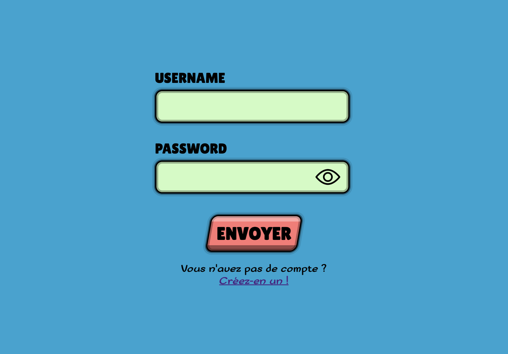
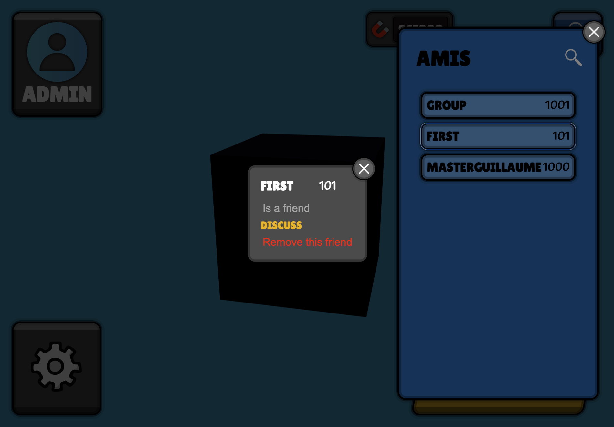
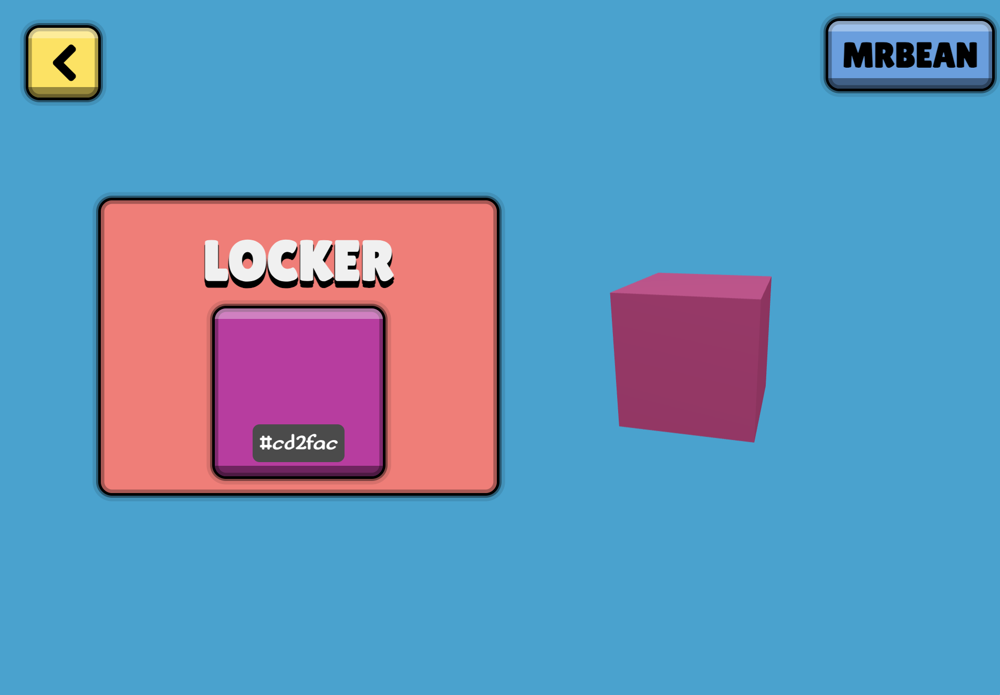
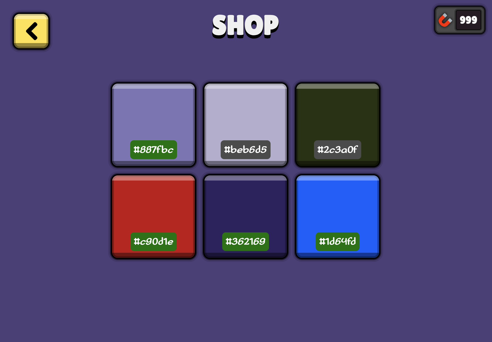
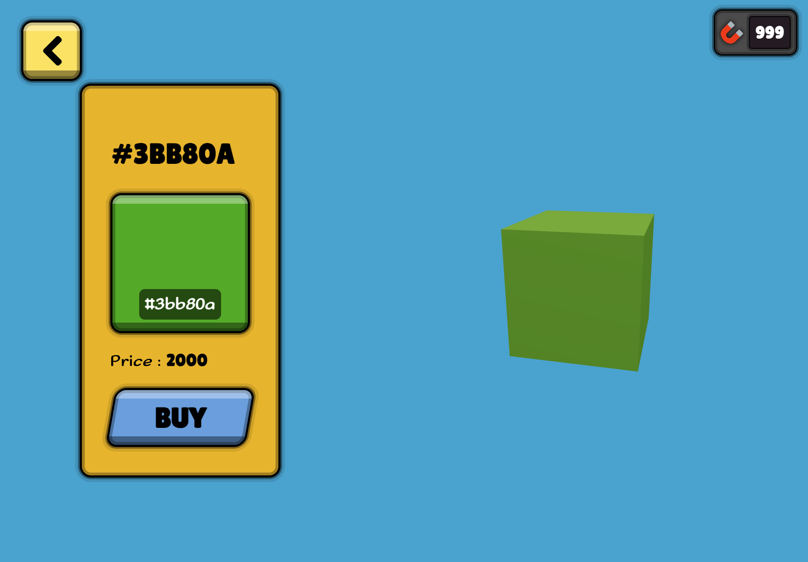
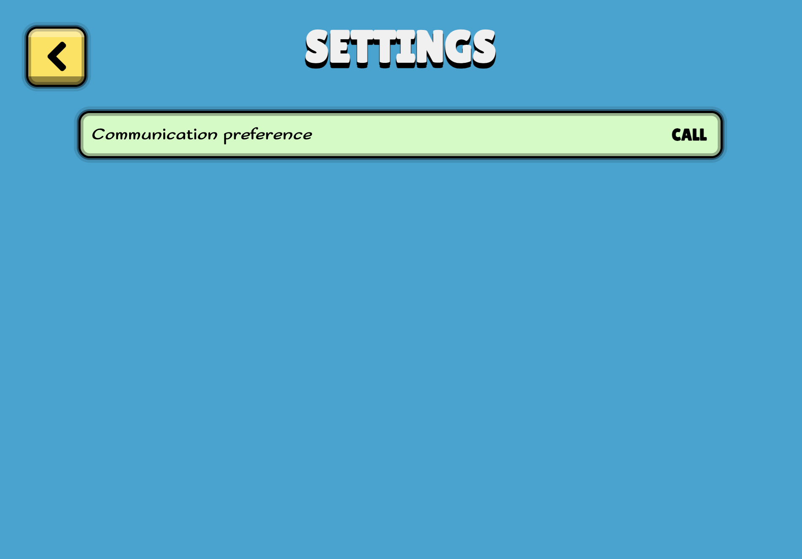
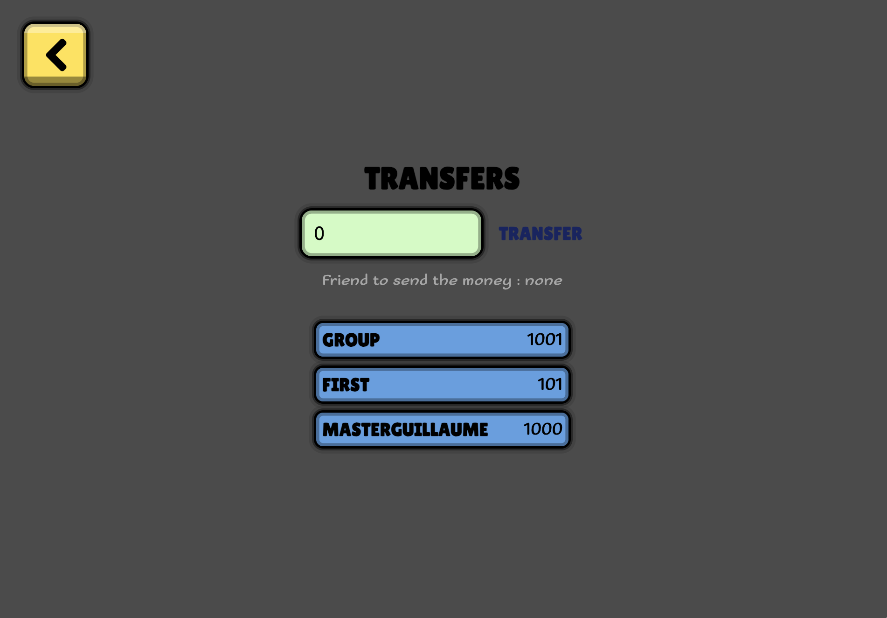

# Project P

## Présentation

Project P est une plateforme où le but est de posséder le plus d'argent possible par tous les moyens fournis. C'est une interface web encapsulé dans Docker, ce projet utilise React et toutes ses bibliothèques associées comme React Cookie, React Three, React Tanstack Query ou encore React Router Dom. Il y a aussi Webpack, Framer Motion, Nginx, Symfony, Mercure, Redis et PostgreSQL.

Il vous est possible de créer un compte, ajouter des amis et discuter avec eux, leur faire des virements bancaires (monnaie virtuelle) et vous pouvez acheter des items dans la boutique afin de personnaliser votre cube, qui fait office d'avatar.

## Lancer le projet

Ce projet utilise Docker et uniquement Docker pour être lancé. Cependant, le projet par du principe que l'adresse `prive.pifpafdeluxe.fr` redirige vers l'hôte du projet. Cela implique un dossier `certificate` avec les certificats valides et reconnus pour le nom de domaine associé.

## Exemples

> 

> 

> 

> 

> 

> 

> 

> 

> 
